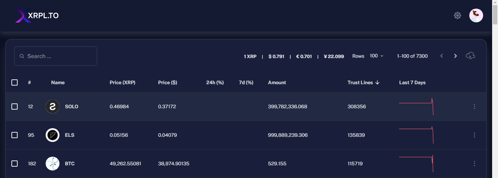
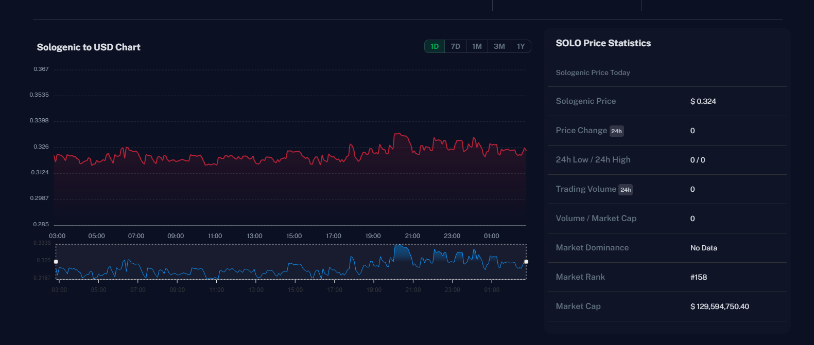
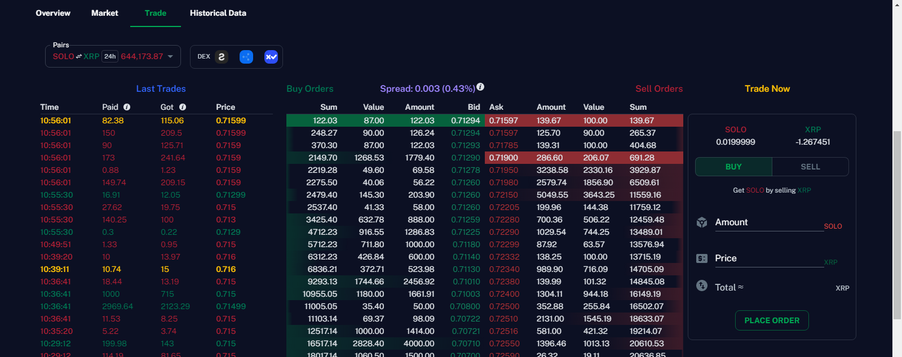

# XRPL.to - Real-Time XRP Ledger Token Analytics

Welcome to the XRPL.to front-end repository! This Next.js application provides comprehensive, real-time analytics for XRP Ledger tokens, including prices, charts, market volumes, and activity metrics.

## Key Features

- **Live Data**: Real-time token prices and market volumes directly from the XRP Ledger
- **Interactive Visualizations**: Dynamic charts for price trends and trading volumes
- **Intuitive UI**: Clean, responsive design for easy navigation of token statistics
- **Comprehensive Analytics**: In-depth token activity metrics and market insights

## Getting Started

### Prerequisites

- Node.js (v14 or later)
- npm (v6 or later)

### Installation

1. Clone the repository:
   ```bash
   git clone https://github.com/your-github/xrpl-token-prices.git
   cd xrpl-token-prices
   ```

2. Install dependencies:
   ```bash
   npm install
   ```

3. Start the development server:
   ```bash
   npm run dev
   ```

## Deployment

### Requirements

- Node.js
- npm

### Steps

1. **Prepare the Environment**:
   Ensure that Node.js and npm are installed on your system. You can download them from [Node.js official website](https://nodejs.org/).

2. **Clone the Repository**:
   ```bash
   git clone https://github.com/your-github/xrpl-token-prices.git
   cd xrpl-token-prices

3. Deploy to Front-End Server:
Use WinSCP or any FTP client to upload the frontend directory to your server at /usr/src/.

4. Run the Front-End Server:
Log in to your server via SSH, navigate to the /usr/src/frontend directory, and execute:

npm run build
npm start


### Screenshots

Here are some previews of the XRPL.to application:








## Contributing

We welcome contributions to XRPL.to! Please see our [CONTRIBUTING.md](CONTRIBUTING.md) for guidelines.

## License

This project is proprietary software. All rights reserved. See [LICENSE.md](LICENSE.md) for details.